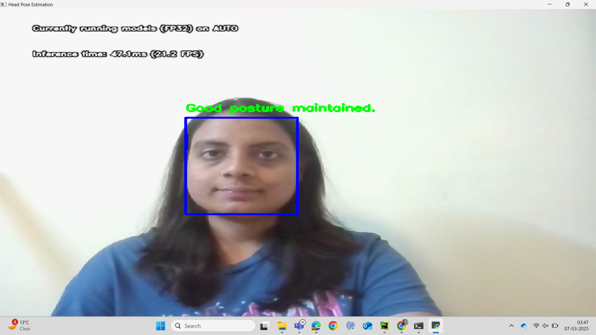
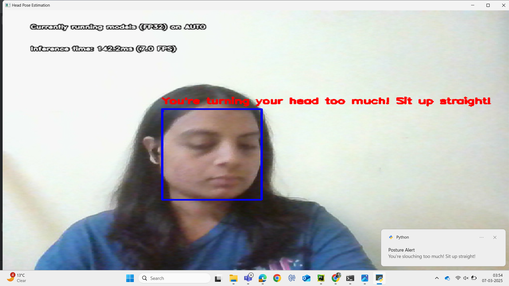

# Fix Your Posture demo with OpenVINO™

This project demonstrates head pose estimation using OpenVINO models. It detects faces, keypoints, and estimates head pose angles (yaw, pitch, roll) to provide feedback on neck posture.

## Features

- Face detection
- Keypoint detection
- Head pose estimation
- Real-time feedback on neck posture
- Notifications for poor posture (Win10toast notifications)





Here are the steps involved in this demo:

Step 1: Install Python and prerequisites

Step 2: Set up the environment

Step 3: Run the Application

Now, let's dive into the steps starting with installing Python. 

## Step 0

Star the [repository](https://github.com/openvinotoolkit/openvino_build_deploy) (optional, but recommended :))

## Step 1

This project requires Python 3.10-3.12 and a few libraries. If you don't have Python installed on your machine, go to https://www.python.org/downloads/ and download the latest version for your operating system. Follow the prompts to install Python, making sure to check the option to add Python to your PATH environment variable.

Install libraries and tools:

```shell
sudo apt install git python3-venv python3-dev
```

_NOTE: If you are using Windows, you may need to install [Microsoft Visual C++ Redistributable](https://aka.ms/vs/16/release/vc_redist.x64.exe) also._

## Step 2

1. Clone the Repository

To clone the repository, run the following command:

```shell
git clone https://github.com/openvinotoolkit/openvino_build_deploy.git
```

The above will clone the repository into a directory named "openvino_build_deploy" in the current directory. Then, navigate into the directory using the following command:

```shell
cd openvino_build_deploy/demos/fix_your_posture_demo
```

2. Create a virtual environment

To create a virtual environment, open your terminal or command prompt and navigate to the directory where you want to create the environment. Then, run the following command:

```shell
python3 -m venv venv
```
This will create a new virtual environment named "venv" in the current directory.

3. Activate the environment

Activate the virtual environment using the following command:

```shell
source venv/bin/activate   # For Unix-based operating system such as Linux or macOS
```

_NOTE: If you are using Windows (Command Prompt), use `venv\Scripts\activate` command instead and use `venv\Scripts\Activate.ps1` for Windows (PowerShell).

This will activate the virtual environment and change your shell's prompt to indicate that you are now working within that environment.

4. Install the Packages

To install the required packages, run the following commands:

```shell
python -m pip install --upgrade pip 
pip install -r requirements.txt
```

## Step 3

To run the application, use the following command:

```shell
python main.py --stream 0
```

To change the models, precision or device use:

```shell
python main.py --stream 0 --device AUTO --face_detection_model_name face-detection-adas-0001 --head_pose_model_name head-pose-estimation-adas-0001 --keypoint_model_name facial-landmarks-35-adas-0002 --model_precision FP16-INT8 --flip True
```

Run the following to see all available options.

```shell
python main.py --help
```
